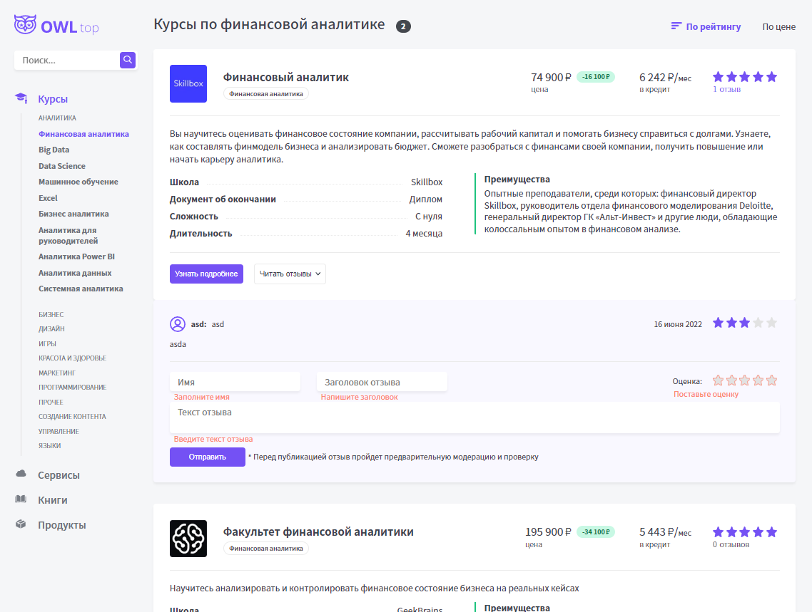

# OWL top - site about different courses

Courses app which foundation is based on Next.js

You can see site on this link - https://next-js-courses-ldsaew.vercel.app/




## Table of Contents

+ [Introduction](#Introduction)
+ [Technologies](#Technologies)
+ [Install](#Install)
+ [Run project](#Run-project)
  + [Middleware](#Middleware)
  + [Development](#Development)
  + [Production](#Production)
+ [License](#License) 


## Introduction

It is my first application created on Next.js. In application you can see a lot of courses in the sphere like web-design or programming or many others. Also you can see how much vacancy exist currently on the hh.ru and payment fork.


## Technologies 

+ React version: 18
+ Next.js version: 13
+ TypeScript version: 4.9
+ framer-motion version: 7 - to be able to add component motion effect
+ react-hook-form version: 7 - to send data from the form to backend
+ classnames version: 2 - help to add variable classes
+ stylelint version: 14 - set style css format which depends on best practics
+ eslint version: 8


## Install

Before running app install it locally using npm

```
npm i 
```


## Run project

### Development 

```
npm run dev
```


### Production 

```
npm run build
npm start
```

Or

```
npm run build
npm run export
```

And then add files from the folder 'out' at any hosting.


## License

This project is licensed under the terms of the MIT license.
